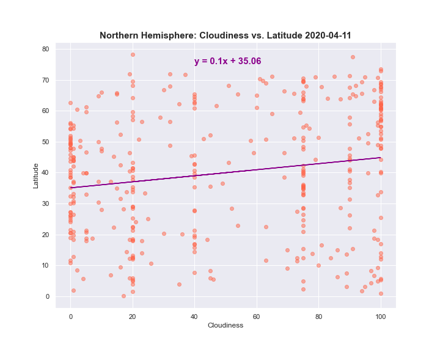
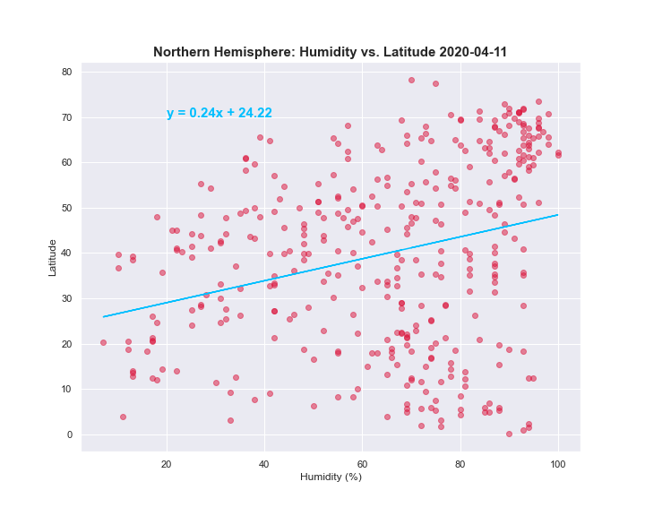
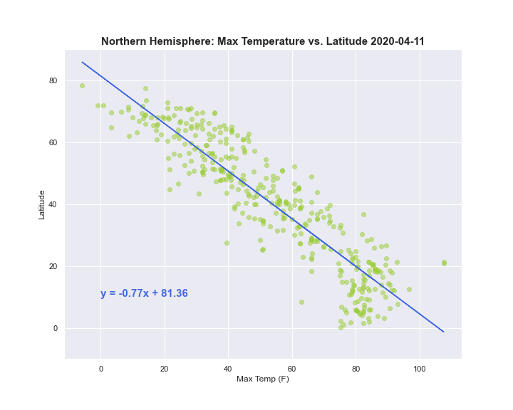
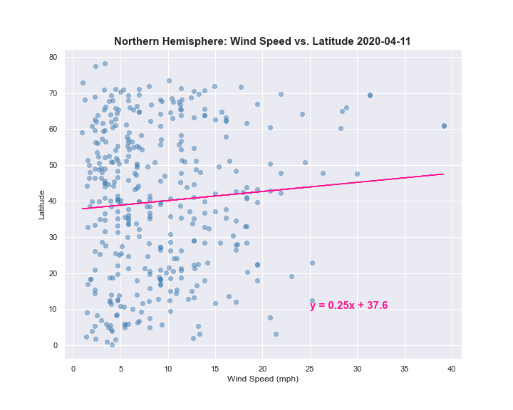

# What's the Weather Like?
### Background
"What's the weather like as we approach the equator?" Create a Python script to visualize the weather of 500+ cities across the world of varying distance from the equator using the [CityPy Python Library](https://pypi.python.org/pypi/citipy), and the [OpenWeatherMap API](https://openweathermap.org/api)

## Part I: Weather
### Northern Hemisphere Figures: 

### Southern Hemisphere 

## Part II: Vacation 

