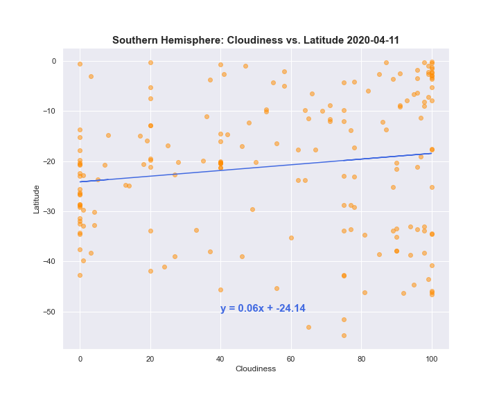
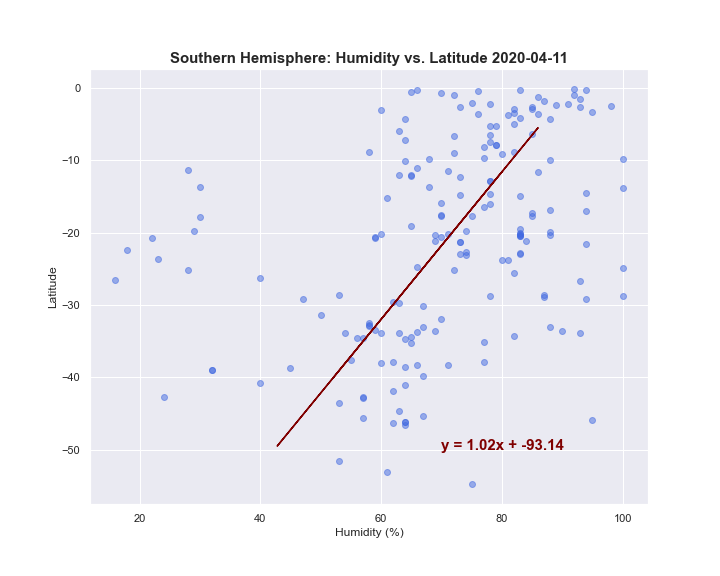
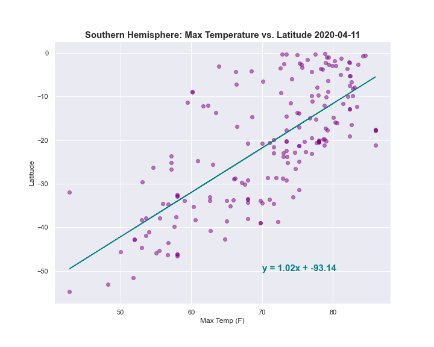
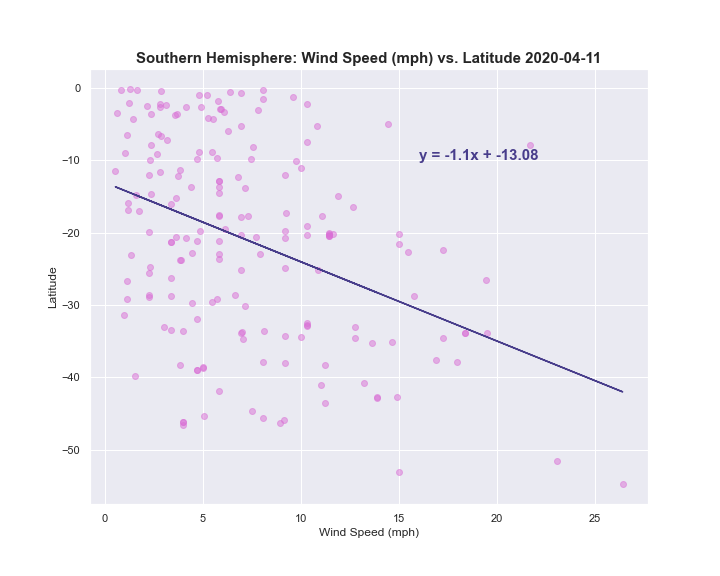
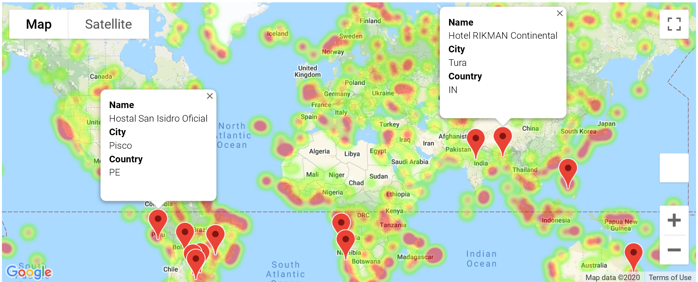

# What's the Weather Like?
### Background
"What's the weather like as we approach the equator?" Create a Python script to visualize the weather of 500+ cities across the world of varying distance from the equator using the [CityPy Python Library](https://pypi.python.org/pypi/citipy), and the [OpenWeatherMap API](https://openweathermap.org/api)

## Part I: Weather
### Northern Hemisphere Figures: 

### Southern Hemisphere Figures: 

## Part II: Vacation 
### Hotel Info:  

## Observable Trends
Temperature decreases towards higher latitude in the Northen Hemisphere. Likewise, temperature in the Southern Hemisphere towards lower latitudes. The highest temperatures occur in the equator, in between the northern and southern hemispheres, which is also evident in the 'Latitude vs Temperature' scatter plot. Wind Speed, Humidity, and Cloudiness are not directly influenced by Latitude as shown in the scatter plots. They are more directly influenced by Temperatures, which is not plotted. Cloudiness has no direct relationship with Temperature, Wind Speed, and Humidity. Humidity appears to depend on Temperature when comparing the 'Latitude vs Temperature' and 'Latitude vs Humidity'. At higher temperatures, the percentage of humidity is also high. 

## Considerations
* The city data generated is based on random coordinates as well as different query times
* Each coordinate triggers a separate call to the Google API. If creating own criteria to plan a vacation, reduce the results 
* In building the script, pay attention to the cities that are used in the query pool. Are you getting coverage of the full gamut of latitudes and longitudes? Or are you simply choosing 500 cities concentrated in one region of the world? Simply rattling 500 cities based on your human selection would create a biased dataset. Be thinking of how this should be countered. (Hint: Consider the full range of latitudes).
